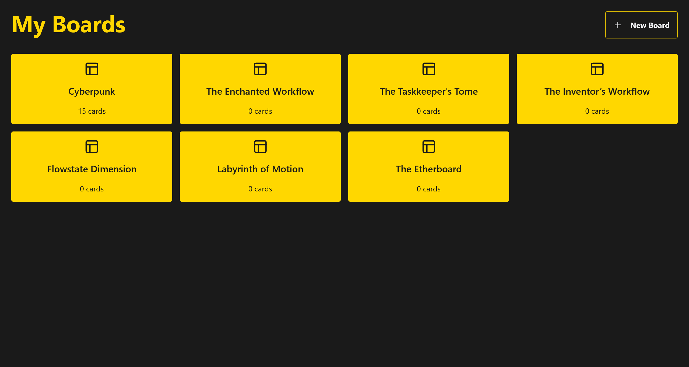
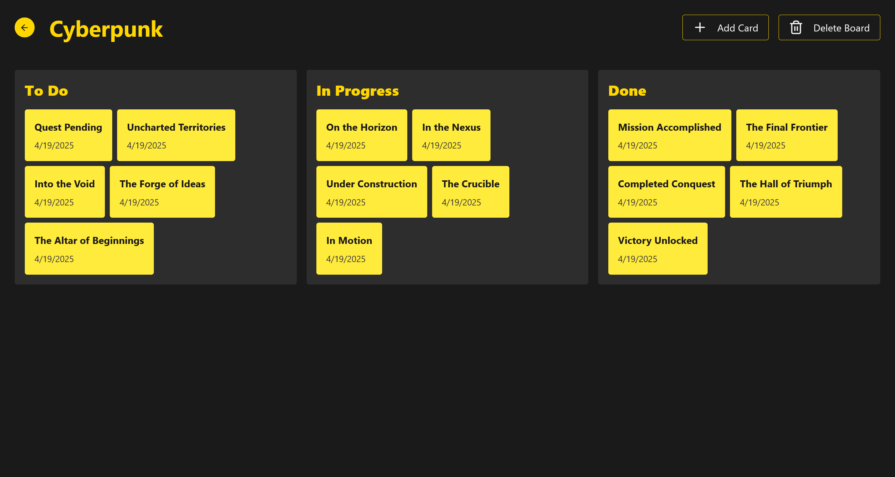
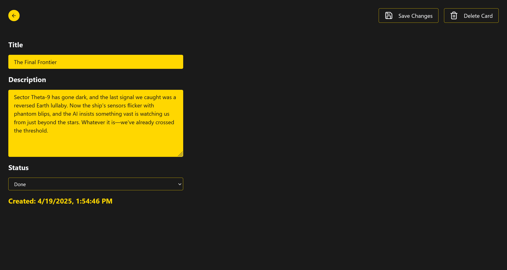

<<<<<<< HEAD
# Kanban Board - React, Redux, TypeScript

This application is a customizable Kanban board built using React, Redux, TypeScript, and Tailwind CSS. The primary focus of the app is to demonstrate the use of Redux Toolkit for state management. The use of TypeScript ensures type safety and better developer experience, while Redux Toolkit efficiently manages the complex state transitions across the board columns.

## Boards

## 

## Board Details

## 

## Card Details

## 

## Features

- **Drag and Drop Interface**:  
  Seamlessly move tasks between columns (To Do → In Progress → Done) with intuitive drag and drop functionality.
- **Board Components**:
  - **Task Cards**: Display title, creation date, and optional description.
  - **Columns**: Organize tasks by status with customizable column titles.
  - **Card Details**: Expand cards to view and edit full details.
  - **Board Management**: Create, rename, and delete boards.
- **State Management**: State management using Redux.
- **Responsive Design**: Styled with Tailwind CSS for consistent UI across devices.

## Learning Objectives

- Implement drag and drop functionality in a **React** and **TypeScript** application.
- Manage complex application state with **Redux Toolkit**.
- Handle routing and navigation between boards with **React Router**.
- Style components dynamically using **Tailwind CSS** utility classes.
- Practice component composition and separation of concerns in a React app.
- Build a fully typed application with TypeScript for improved development experience.

## Taking a Look at the Completed Project

To set up the project after forking or downloading it from GitHub, follow these steps:

1. Open with your favorite code editor

2. Install the required dependencies by running the following command:

```
npm install
```

3. Start the development server by running the following command:

```
npm run dev
```

Happy Coding and Learning 😊
=======
# React-Redux-Typescript-React-Router-Tailwind
>>>>>>> 8eef65447ec5b0490492874c87fee8dd00391fe1
